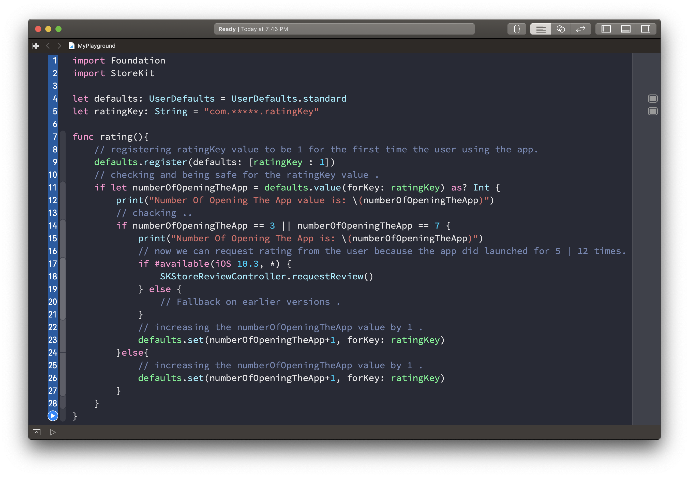
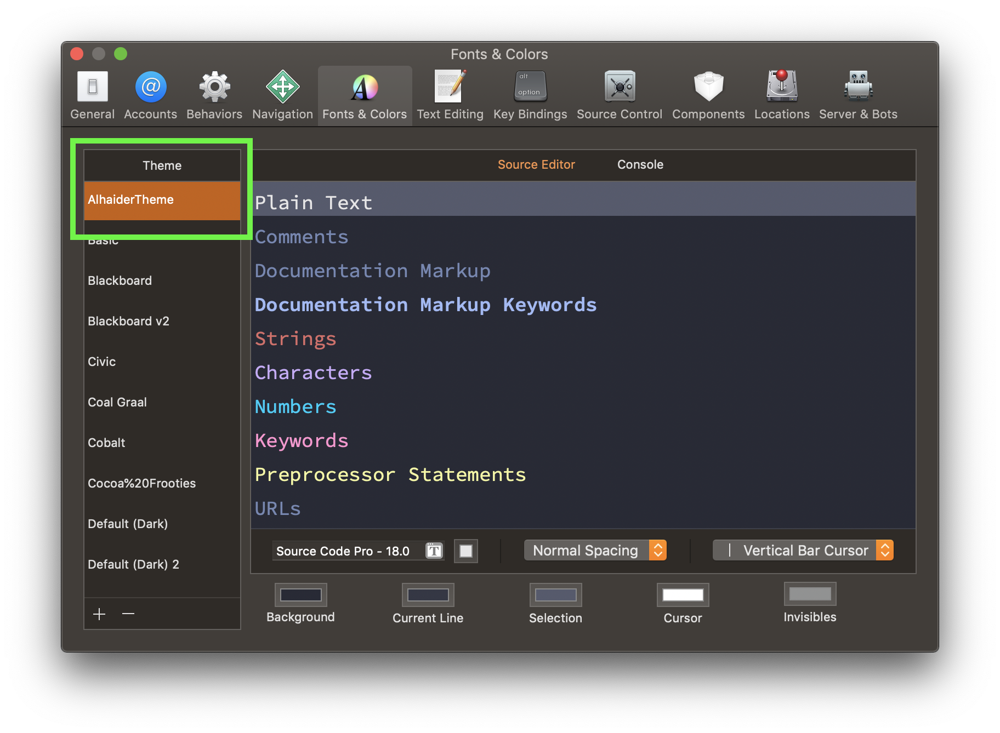

# Abdullah Alhaider - Xcode Theme colors & fonts



## Installing using Terminal app

1. Open Terminal app from your MacOS apps to clone this repo:
```
$ git clone https://github.com/cs4alhaider/XcodeTheme.git 
$ cd XcodeTheme
$ open .
```

2. Navigate or create a folder at this path if it doesn't exist already:
```
$ cd ~/Library/Developer/Xcode/UserData/FontAndColorThemes
$ open .
```

3. Copy the file `AlhaiderTheme.xccolortheme` into the above folder.

4. For the fonts, download the latest release of Source Code Pro from [its repo](https://github.com/adobe-fonts/source-code-pro).

5. Unzip the font archive and move the files in the `TTF` folder to `~/Library/Fonts`.

6. Quit Xcode then open it.

7. Now you should see it 🥳.

